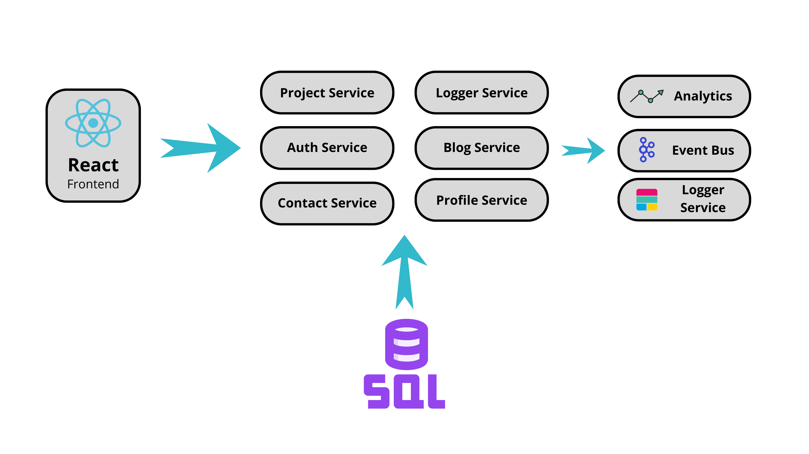

# Portfolio Microservices Platform

## 🚀 Project Overview

A comprehensive, modern web application built with a microservices architecture, showcasing advanced software engineering practices and full-stack development skills.

## 🔧 Tech Stack

### Backend
- **Language**: Node.js
- **Architecture**: Microservices
- **Communication**: Event-Driven (Kafka)
- **API Gateway**: Express.js
- **Authentication**: JWT, JWKS
- **Database**: MySQL
- **Logging**: ELK Stack (Elasticsearch, Logstash, Kibana)

### Frontend
- **Framework**: React
- **State Management**: TBD
- **Styling**: Tailwind CSS
- **Routing**: React Router

### Infrastructure
- **Containerization**: Docker
- **Orchestration**: Docker Compose (for local development)
- **Event Streaming**: Apache Kafka

## 📦 Microservices

### Core Services

1. **Authentication Service**
   - User registration and login
   - JWT token management
   - Role-based access control

2. **Profile Service**
   - Manage personal and professional profile
   - CRUD operations for skills, experiences
   - Dynamic profile updates

3. **Projects Service**
   - Showcase professional projects
   - Technology stack tracking
   - Project details management

4. **Blog Service**
   - Personal blog management
   - Article CRUD operations
   - Category and tag support

5. **Contact Service**
   - Contact form management
   - Message tracking
   - Email notification system

6. **Analytics Service**
   - Track user interactions
   - Page view logging
   - User behavior insights

7. **Logger Service**
   - Centralized logging
   - Log aggregation
   - Advanced log searching and filtering

8. **Event Bus Service**
   - Kafka-based event streaming
   - Inter-service communication
   - Event routing and processing

9. **API Gateway**
   - Request routing
   - Authentication middleware
   - Rate limiting
   - Logging

## 🗂️ Project Structure

```
portfolio/
├── backend/
│   ├── api-gateway/
│   ├── auth-service/
│   ├── profile-service/
│   ├── projects-service/
│   ├── blog-service/
│   ├── contact-service/
│   ├── analytics-service/
│   ├── logger-service/
│   ├── event-bus/
│   └── shared/
│
├── frontend/
│   ├── src/
│   │   ├── components/
│   │   ├── pages/
│   │   ├── services/
│   │   └── utils/
│   └── ...
│
└── docker-compose.yml
```



## 🔐 Authentication Flow

1. User submits credentials
2. Auth Service validates credentials
3. Generate JWT with JWKS
4. Token includes roles and permissions
5. API Gateway validates token for protected routes

## 📊 Event-Driven Architecture

- Services communicate via Kafka topics
- Event Types:
  - `PROFILE_CREATED`
  - `PROJECT_UPDATED`
  - `ARTICLE_PUBLISHED`
  - `MESSAGE_RECEIVED`

## 🌟 Key Features

- Microservices architecture
- Event-driven communication
- Role-based access control
- Comprehensive logging
- Real-time analytics
- Secure authentication

## 📦 Local Development

### Prerequisites
- Node.js 18+
- Docker
- Docker Compose
- MySQL
- Elasticsearch
- Kafka

### Setup

1. Clone the repository
```bash
git clone https://github.com/yourusername/portfolio-microservices.git
cd portfolio-microservices
```

2. Create environment files
```bash
cp backend/.env.example backend/.env
cp frontend/.env.example frontend/.env
```

3. Start services
```bash
docker-compose up --build
```

## 🚢 Deployment

- Docker containers
- Potential Kubernetes integration
- CI/CD with GitHub Actions

## 🔍 Monitoring & Observability

- ELK Stack for logging
- Prometheus and Grafana (planned)
- Distributed tracing with Jaeger (planned)

## 📜 License

MIT License